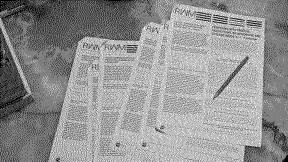

# Composing With Process RSS

An (stale) RSS feed for Mark Fell's+Joe Gilmore's MACBA production [*Composing With Process. Perspectives on Generative Music*](https://rwm.macba.cat/en/taxonomy_serie_podcast/composing-with-process/) which was published on Radio Web MACBA 2010-2013.

I didn't do any of this, but I am just compiling an RSS for my own re(re(re))listening purposes as a podcast.

## Episodes

1. Continue
2. Systems
3. Determinacy and Indeterminacy
4. Time
5. Duration
6. Space
7. Approaches to Change
8. Models of Change
9. Two Discrete Generative Systems

In addition to the main piece, each episode has a PDF transcript andmany an exclusive. I recommend downloading everything using the provided Python program `download.py` or manually in the case this valuable thing goes into bit heaven, and printing the transcripts for study.

